# TDR-0001 Merch Store

| | |
|---|---|
| **Версия** | 1.0 (Draft) |
| **Статус** | На согласовании |
| **Дата** | 2026-05-28 |
| **Автор / Проектировщик** | mihnpro |
| **Бизнес-спецификация** | [`FINAL_SPEC.md`](./FINAL_SPEC.md) |
| **Шаблоны процесса** | [`Flow.md`](./Flow.md), [`TemplateDescription.md`](./TemplateDescription.md), [`TemplateProposal.md`](./TemplateProposal.md) |

---

## ЧАСТЬ 1 — ОПИСАНИЕ

### 1. Описание требуемых изменений

Спроектировать и реализовать MVP корпоративного магазина мерча — внутренний веб-сервис, в котором сотрудник может потратить корпоративные баллы на брендированную продукцию, а HR — управлять каталогом, остатками, балансом сотрудников и заказами.

Бизнес-сценарии, объём, граничные случаи и критерии приёмки зафиксированы в [`FINAL_SPEC.md`](./FINAL_SPEC.md). Этот TDR описывает **техническую реализацию** MVP.

### 2. Ценность. Предназначение

**Целевая аудитория:**
- **Сотрудники компании** — конечные покупатели; видят каталог, оформляют заказы за баллы, наблюдают статусы.
- **HR / администраторы магазина** — управляют каталогом, остатками, начисляют баллы, обрабатывают заказы.

**Ценность:**
- Сотрудник тратит на оформление заказа ≤ 1 минуты против многоминутной переписки сегодня.
- HR разгружается от ручной сверки и переписки — получает список заказов на отгрузку и инструменты экспорта.
- Прозрачные остатки и наличие размеров устраняют сюрпризы «в наличии не оказалось».
- Учёт списаний баллов становится строгим — нет ручных ошибок.

### 3. Контекст и постановка проблемы

Сегодня процесс покупки мерча выглядит так:

1. Сотрудник пишет HR в мессенджере, уточняет, какие позиции вообще есть.
2. HR сверяется со складом «вручную», возвращается с ответом.
3. Уточняется размер; иногда выясняется, что нужного размера уже нет.
4. Договариваются о выдаче, фиксируют списание баллов в Excel-таблице.

Проблемы:
- HR тратит несколько часов в неделю на рутинную переписку.
- Excel-учёт баллов и складские остатки расходятся → жалобы и конфликты.
- Сотрудники не знают, на что вообще можно потратить накопленные баллы → демотивация инструмента.
- Нет истории и аналитики — нельзя ответить, какие позиции популярны, сколько баллов фактически тратится.

Нужен веб-сервис, который автоматизирует процесс end-to-end и становится единым источником истины для остатков и операций по баллам.

### 4. Владельцы

| Роль | Кто |
|---|---|
| Заказчик изменений (Product Owner) | TBD |
| Проектировщик решения | mihnpro |
| Автор архитектурного решения | mihnpro |
| Автор (команда) реализации | TBD |

### 5. Глоссарий / Информационная архитектура

| Термин | Значение |
|---|---|
| **Баллы (points)** | Корпоративная валюта; целое число; не может быть отрицательным. |
| **Корзина (cart)** | Личный список товаров сотрудника, готовый к оформлению. Хранится в PostgreSQL постоянно; в Redis — кеш с TTL 30 мин. |
| **Остаток (stock)** | Количество доступных единиц товара по размеру. Не может быть отрицательным. |
| **Резерв (reservation)** | Часть остатка, забронированная под заказ; снимается при выдаче или отмене. |
| **Заказ (order)** | Зафиксированный набор позиций, оплаченный баллами; имеет статус. |
| **Статус заказа** | `pending → confirmed → ready_to_pickup → delivered` или `cancelled`. |
| **Мягкая деактивация** | Товар скрывается из каталога (`active=false`), но остаётся в исторических заказах. |
| **Роль (role)** | `user` или `admin`; зашита в JWT. |
| **JWT** | Подписанный токен (HS256/RS256). Access — 15 мин, refresh — 30 дней в Redis. |
| **Идемпотентность** | Повторный вызов с тем же ключом не повторяет эффекта. Ключи: `order_id` для списаний/резервов, `operation_id` для начислений/изменений остатков. |
| **Outbox-паттерн** | Событие сохраняется в таблицу `outbox` в одной транзакции с бизнес-данными; отдельный воркер досылает событие в Kafka. Гарантия at-least-once. |
| **Choreography saga** | Распределённая транзакция без центрального оркестратора; компенсации запускаются доменными сервисами. |
| **Media-загрузка** | Загрузка фото товара через Media Service: файл идёт `браузер → Media Service → MinIO` единым потоком (multipart/streaming); браузер с MinIO напрямую не общается. |
| **NetworkPolicy** | Сетевая политика в Kubernetes, ограничивающая входящий трафик к подам. |
| **Graceful degradation** | Деградация без видимых пользователю ошибок при сбое вспомогательного компонента (Redis). |

### 6. Сущности и пользовательские сценарии

**Доменные сущности (логически):** User, PointsBalance, PointsTransaction, Product, Stock, Reservation, Cart, CartItem, Order, OrderItem, Outbox-event. Подробная модель и атрибуты — в §17.

**Действующие лица:**
- Сотрудник (`role=user`) — браузер.
- Администратор (`role=admin`) — браузер.
- Системные акторы — Inventory Service (Kafka consumer), Outbox worker (фон в Order Service).

**Укрупнённые пользовательские сценарии (детальные UC-01..UC-27 в [`merch-store-usecases.txt`](./merch-store-usecases.txt)):**

| # | Сценарий | Роль | Источник |
|---|---|---|---|
| S-01 | Регистрация и вход | user | UC-01..UC-05 |
| S-02 | Просмотр каталога с фильтрами | user | UC-06 |
| S-03 | Управление корзиной | user | UC-07..UC-10 |
| S-04 | Оформление заказа | user | UC-11 |
| S-05 | Просмотр своих заказов и баланса | user | UC-12..UC-14 |
| S-06 | Смена пароля | user | UC-15 |
| S-07 | Управление каталогом и фото | admin | UC-18..UC-20 |
| S-08 | Управление остатками | admin | UC-21 |
| S-09 | Начисление баллов | admin | UC-22 |
| S-10 | Управление пользователями | admin | UC-23 |
| S-11 | Управление и экспорт заказов, отмена | admin | UC-24..UC-26 |
| S-12 | Базовая аналитика | admin | UC-27 |

### 7. Декомпозиция на MVP

В рамках MVP реализуется один релиз; внутри — порядок разработки по этапам, каждый этап завершается работоспособной частью системы:

| Этап | Что добавляется | Что можно проверить end-to-end |
|---|---|---|
| 1 | API Gateway, User Service, Product Service | Регистрация, вход, просмотр каталога |
| 2 | Cart Service, Inventory Service | Добавление в корзину с проверкой остатков |
| 3 | Order Service, Kafka, Outbox | Оформление заказа с резервированием |
| 4 | Media Service, MinIO | Загрузка фото через Media Service (multipart) и создание товара админом |
| 5 | Админ-методы в существующих сервисах (`role=admin`), экспорт заказов, базовая аналитика | Полный admin-флоу |

**В MVP не входит** (вынесено как backlog):
- Уведомления (email, мессенджеры, push).
- Возвраты и сложная история транзакций.
- Промокоды, скидки, акции.
- Автоматический фулфилмент и интеграция со складскими системами.
- Mobile-приложения.
- SSO/HR-интеграции.

### 8. Функциональные требования

Приведены укрупнённо; детальные правила и граничные случаи — в [`FINAL_SPEC.md`](./FINAL_SPEC.md) §3.

**FR-AUTH:**
1. Регистрация по уникальному логину, паролю (bcrypt cost=12) и имени.
2. Вход возвращает пару токенов: access (TTL 15 мин), refresh (TTL 30 дней в Redis).
3. Автопродление access по refresh без участия пользователя.
4. Logout отзывает текущий refresh (`DEL refresh:{jti}`).
5. Смена пароля отзывает все refresh-токены пользователя (`SREM user_refresh_tokens:{user_id}`).
6. После 5 неудачных подряд попыток входа — временная блокировка учётки (rate limiter на Gateway).

**FR-CATALOG:**
7. Каталог постранично (24 шт.), сортировка по `created_at DESC`, фильтр по `category`, поиск по `name`.
8. Деактивированные товары не отображаются (`active=true` в WHERE).
9. Карточка показывает наличие по размерам (читает Inventory).

**FR-CART:**
10. AddItem проверяет остаток через Inventory.CheckStock; берёт цену и имя из Product.GetProduct (снапшот).
11. Корзина хранится в PostgreSQL постоянно; Redis — write-through кеш с TTL 30 мин.
12. При недоступности Redis — graceful fallback на PostgreSQL.
13. Автоматической очистки корзины по времени **нет**: содержимое живёт до явных действий пользователя (CreateOrder, Clear, Remove).

**FR-ORDER:**
14. CreateOrder идемпотентен по `order_id` (UUID, генерируется на клиенте или Gateway).
15. Шаги: GetCart → GetBalance → DeductPoints(`order_id`) → INSERT orders+outbox → ClearCart. Всё в одной транзакции на стороне Order Service.
16. Outbox-воркер досылает `order.created` в Kafka.
17. Inventory consumer резервирует остатки атомарно (несколько UPDATE stock + INSERT reservation в транзакции); переводит заказ в `confirmed` через Order.UpdateStatus.
18. Если резерв не удался — Order.UpdateStatus(`cancelled`) запускает компенсацию: AddPoints + ReleaseReserve, обе идемпотентны.

**FR-LIFECYCLE:**
19. Допустимые переходы: `pending → confirmed | cancelled`, `confirmed → ready_to_pickup | cancelled`, `ready_to_pickup → delivered`. Любой другой — отклоняется с `FAILED_PRECONDITION`.
20. Отмена (`cancelled`) запускает компенсацию: возврат баллов (`operation_id=order_id+"-refund"`) и снятие резерва (`order_id`).

**FR-ADMIN:**
21. Все admin-методы дополнительно проверяют `role=admin` через `pkg/auth.AdminOnly` в gRPC-интерсепторе, независимо от Gateway.
22. AdjustStock работает по дельте, требует `reason`; идемпотентен по `operation_id`; запрещает уход остатка в минус.
23. GrantPoints/AddPoints идемпотентны по `operation_id`; для суммы > 100 000 требуется флаг `confirmed=true`.
24. ResetPassword возвращает одноразовый пароль; BlockUser запрещает заблокировать самого себя; ChangeRole не позволяет понизить последнего активного администратора.
25. Загрузка фото: браузер шлёт `Media.UploadPhoto(filename, content_type, bytes)` (gRPC streaming или HTTP multipart). Media Service проверяет `role=admin`, валидирует content-type (jpeg/png/webp) и размер (≤ 5 МБ), генерирует ключ `products/{uuid}.{ext}`, выполняет `MinIO.PutObject` со стримом и возвращает `photo_key`. Затем браузер шлёт `Product.CreateProduct` с этим `photo_key`.
26. ExportOrders — выгрузка в Excel; при больших объёмах — асинхронно с прогрессом.

### 9. Нефункциональные требования

**Безопасность:**
- Пароли — bcrypt cost=12.
- JWT — HS256 (стейдж) / RS256 (прод); access 15 мин, refresh 30 дней в Redis с привязкой к `user_id`.
- Rate limiter на Gateway (5 неудачных логинов → блокировка на 5 мин).
- `pkg/auth.AdminOnly` интерсептор в каждом сервисе с админ-методами — защита в глубину поверх Gateway-маршрутов `/admin/*`.
- NetworkPolicy в Kubernetes: домейн-сервисы принимают gRPC только от Gateway и от сервисов по контракту (Order ↔ Cart/User/Inventory, Cart ↔ Product/Inventory). Inventory consumer принимает соединения только от Kafka.
- Media Service — единственный сервис, имеющий доступ к MinIO на запись (PutObject); NetworkPolicy запрещает остальным сервисам сетевой доступ к MinIO API. Браузер с MinIO напрямую не общается.
- Лимит на размер запроса в Media Service — 6 МБ (с запасом к 5 МБ полезной нагрузки) во избежание DoS большими файлами.
- Секреты — Kubernetes Secrets, не в репозитории.

**Хранение данных:**
- DB per service: 5 независимых PostgreSQL-инстансов (Product, Cart, Order, User, Inventory). Независимые миграции через `migrate`.
- Redis: refresh-токены, кеш корзин.
- MinIO: bucket `merch-products` с публичным чтением для GET (только бинарники фото).
- Видимость: пользователь видит только свои заказы (`WHERE user_id = jwt.user_id`), баланс и операции; админ — без ограничений на read.

**Производительность (target SLA):**
| Операция | p95 |
|---|---|
| ListProducts | < 500 ms |
| GetCart (из Redis) | < 100 ms |
| CreateOrder (sync-часть) | < 2 сек |
| GetProduct | < 300 ms |

**Масштабирование:** HPA (см. §21 «Масштабирование»).

### 10. Связанная информация / Ссылки

- [`FINAL_SPEC.md`](./FINAL_SPEC.md) — бизнес-уровневая спецификация MVP.
- [`specification.md`](./specification.md) — ранняя техническая черновая спецификация.
- [`README.md`](./README.md) — архитектурное описание, 8 ADR, план разработки.
- [`diagrams.md`](./diagrams.md) — исходные mermaid-диаграммы (продублированы ниже).
- [`service-interactions.txt`](./service-interactions.txt) — детальные межсервисные взаимодействия и надёжность.
- [`service-api-reference.txt`](./service-api-reference.txt) — справочник методов gRPC и идемпотентности.
- [`merch-store-usecases.txt`](./merch-store-usecases.txt) — UC-01..UC-27.

---

## ЧАСТЬ 2 — РЕШЕНИЕ

### 11.0 Карта диаграмм (для ревьюера)

`TemplateProposal.md` перечисляет пять обязательных категорий диаграмм. Маппинг на разделы TDR:

| Категория из `TemplateProposal.md` | Где в TDR |
|---|---|
| Архитектурная модель (C4) + Структура БД | §11.1 (C4 L1 Context), §11.1.1 (C4 L2 Container), §11.1.2 (C4 L3 Component для Order Service); §17 (ER-диаграммы по сервисам) |
| Диаграмма потока данных по сценариям | §11.2–11.8 (8 sequence-диаграмм по ключевым сценариям) + §11.9 (state diagram заказа) |
| Карта межсервисного взаимодействия | §18.1 (синхронные gRPC-вызовы) |
| Диаграмма событийных взаимодействий | §18.2 (асинхронные события в Kafka) |
| Изменения в ролевой модели | §17.0 (целевая ролевая модель: роли, матрица прав, инварианты) |

### 11. Решение (summary)

Микросервисная архитектура из шести прикладных сервисов на Go: **API Gateway**, **Product Service**, **Cart Service**, **Order Service**, **User Service**, **Inventory Service**, **Media Service** — с собственными PostgreSQL-инстансами и общими компонентами (Redis, Kafka, MinIO). Между сервисами — gRPC; асинхронное событие `order.created` идёт через Kafka с гарантией at-least-once через Outbox.

Отдельного admin-сервиса нет. Админ-методы реализованы в тех же доменных сервисах и защищены проверкой `role=admin` через общий интерсептор `pkg/auth.AdminOnly` плюс маршрутным ограничением `/admin/*` на Gateway.

#### 11.1 C4 Level 1 — System Context

Границы системы и внешние акторы. Внешних систем (HR, мессенджеров, CRM) в MVP нет.

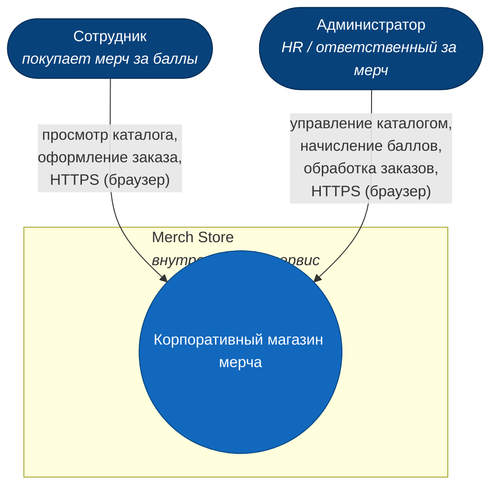

#### 11.1.1 C4 Level 2 — Containers

Все развёртываемые контейнеры с протоколами связи. Технологии указаны явно.

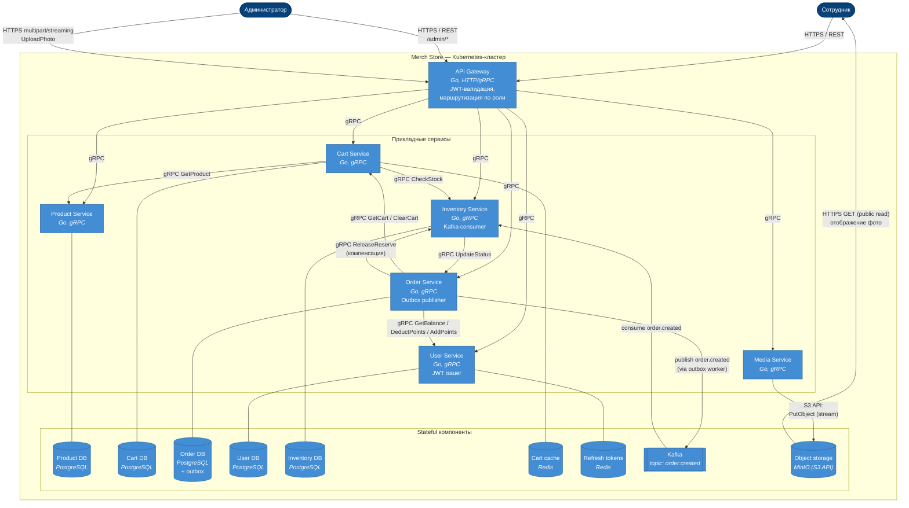

#### 11.1.2 C4 Level 3 — Components (Order Service)

Внутренности самого сложного сервиса. Остальные сервисы устроены проще и однотипно (handler → service → repository) — детализация не требуется.

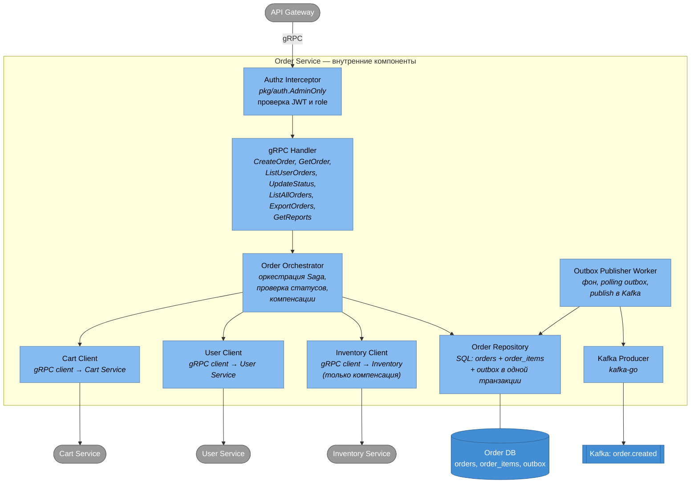

#### 11.2 Главный поток — оформление заказа

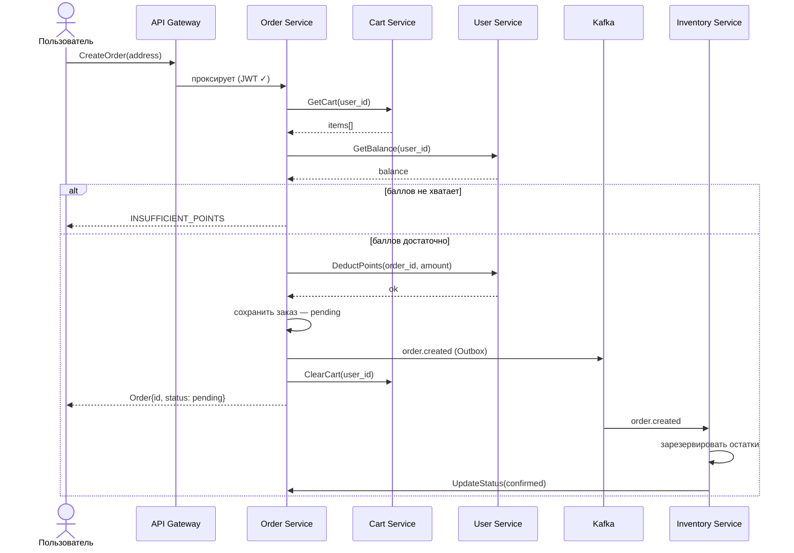

#### 11.3 Добавление товара в корзину

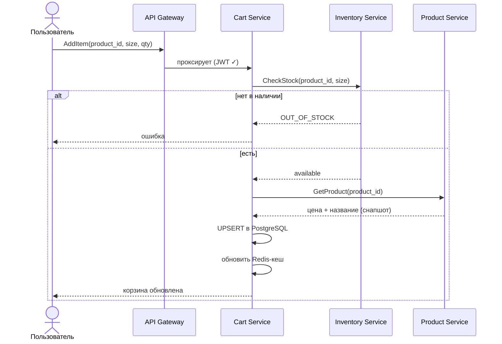

#### 11.4 Загрузка фото и создание товара (admin)

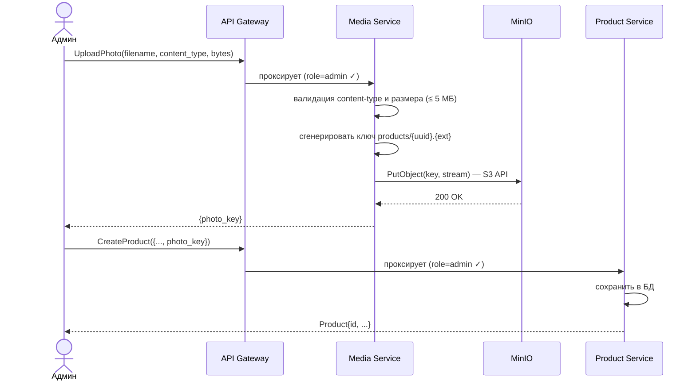

#### 11.5 Вход и выдача токенов

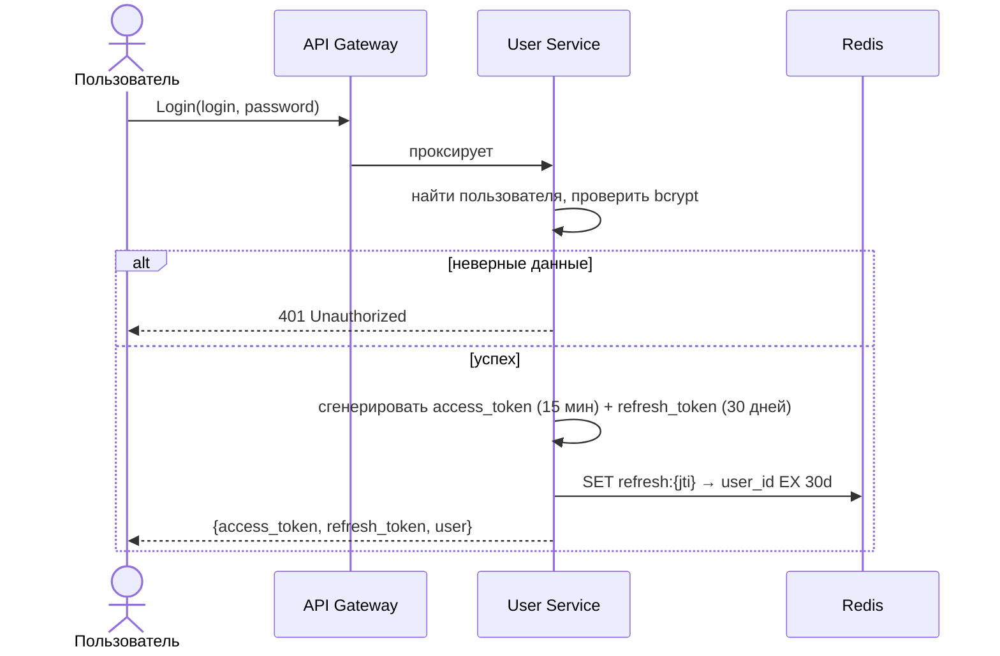

#### 11.6 Обновление access-токена

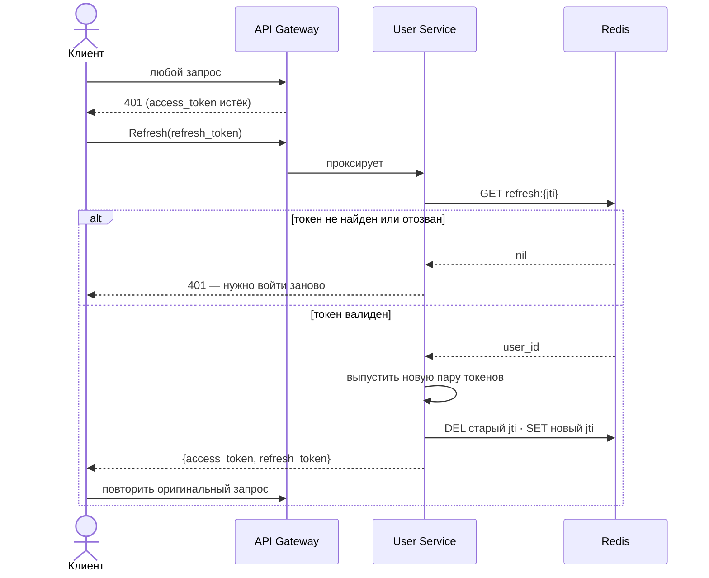

#### 11.7 Отмена заказа (компенсация)

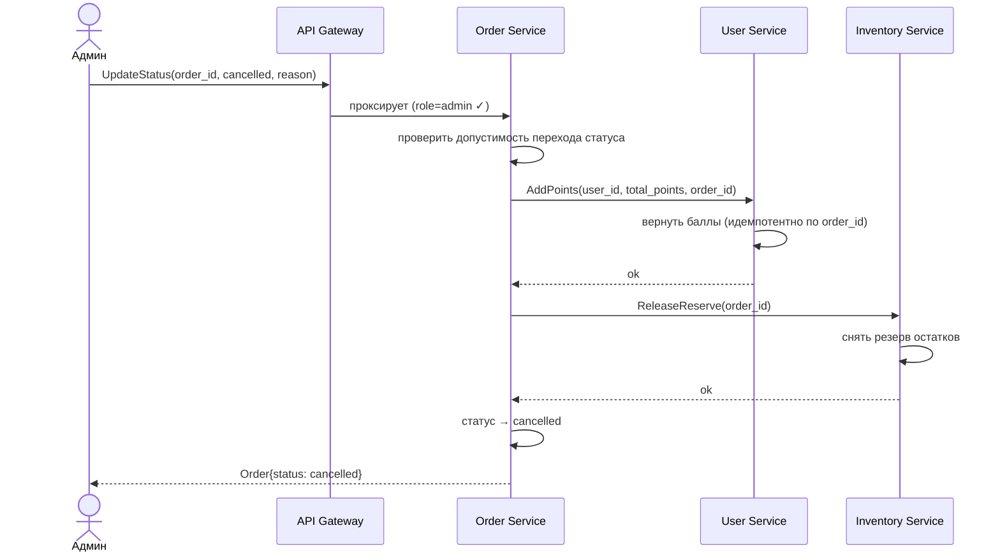

#### 11.8 Начисление баллов (admin)

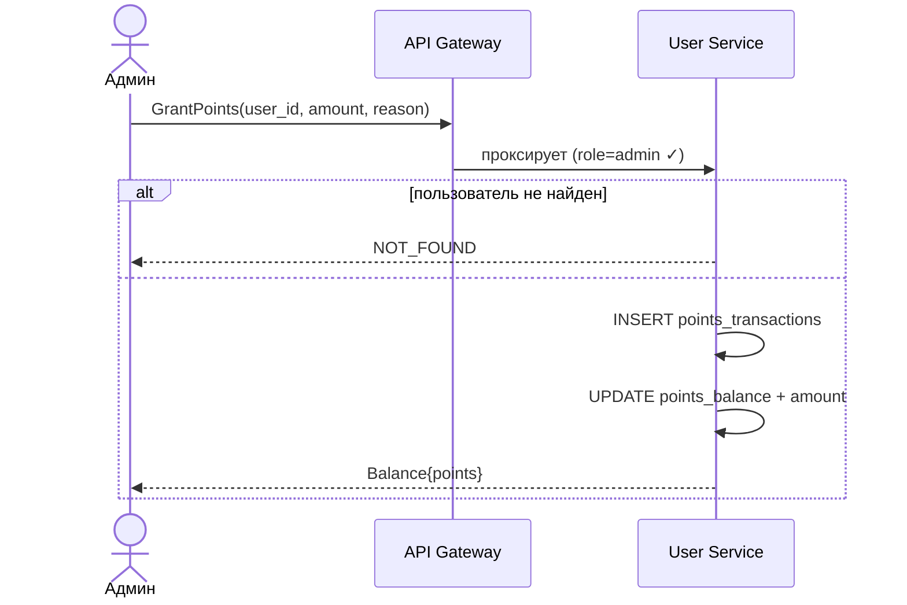

#### 11.9 Состояния заказа

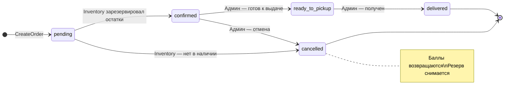

### 12. Рассмотренные варианты

| # | Развилка | Принято | Отклонено и почему |
|---|---|---|---|
| 1 | Протокол межсервисного взаимодействия | gRPC + Protobuf | REST/JSON — отсутствие строгого контракта, выше latency, нет HTTP/2 mux. |
| 2 | Резервирование остатков | Асинхронно через Kafka (`order.created`) + Outbox | Sync gRPC из Order в Inventory — оформление заказа становится зависимым от доступности Inventory. |
| 3 | Хранилище данных | DB per service (PostgreSQL × 5) | Общая БД — связность миграций и операций, кросс-сервисные транзакции. |
| 4 | Корзина | PostgreSQL (источник истины) + Redis write-through cache (TTL 30 мин) | Только Redis — потеря корзины при истечении TTL/перезапуске. Только PostgreSQL — выше latency на GetCart. |
| 5 | Админ-доступ | `role=admin` в JWT, проверка в каждом сервисе через общий интерсептор + `/admin/*` на Gateway | Отдельный admin-service — лишний сервис, межсервисные хопы, дополнительные точки отказа. |
| 6 | Гарантии доставки в Kafka | Outbox-паттерн, фоновый воркер досылает | Прямая публикация в Kafka из транзакции — риск «commit БД успешен, publish упал». |
| 7 | Загрузка файлов | Multipart/streaming загрузка через Media Service (браузер не общается с MinIO напрямую) | Presigned URL и прямая запись браузером в MinIO — отвергнуто: расширяет поверхность атаки на MinIO, усложняет валидацию формата/размера, требует публичного PUT-эндпоинта MinIO. Streaming в Media Service устраняет проблему буферизации, ограничение размера запроса (≤ 6 МБ) исключает DoS. |
| 8 | Объектное хранилище | MinIO (S3 API) | Прямое использование AWS S3 в MVP — внешняя зависимость и расходы; миграция в облако позже возможна без изменения кода. |
| 9 | Координация распределённой транзакции (создание заказа) | Choreography saga (Order оркеструет напрямую, без отдельного сервиса) | Orchestrator service — оверхед для MVP с одним заметным потоком. |
| 10 | Ключи идемпотентности | `order_id` для DeductPoints/Reserve/Release; `operation_id` (UUID) для AddPoints/AdjustStock | Без идемпотентности — двойные списания при ретраях. |

### 13. Факторы влияния на решение

- **Стейкхолдеры:** внутренний продукт, единственный заказчик — компания; нет внешних потребителей API.
- **Объём:** десятки/сотни активных сотрудников, единицы заказов в день в пике; малый объём данных позволяет избегать преждевременной оптимизации (шардинга и т. п.).
- **Команда:** 1–2 разработчика на Go; нужен компактный набор сервисов и понятный stack.
- **Надёжность:** списания баллов и резервы — критичны (не должны теряться или дублироваться). Это диктует идемпотентность, Outbox и компенсации.
- **Инфраструктура:** есть Kubernetes-кластер; разворачивание stateful-компонентов (Postgres, Kafka, MinIO) — приемлемо.
- **Безопасность:** магазин ограниченно доступен сотрудникам, но операции с баллами требуют надёжной авторизации и защиты в глубину.
- **Сроки:** ограничены — отсюда минимизация количества сервисов и отказ от лишних абстракций (отдельный admin-service, audit_log, оркестратор саги).

### 14. Преимущества

- **Чёткое разделение ответственности** — каждый сервис владеет своими данными и контрактами.
- **Независимое масштабирование** критичных подов (Gateway, Order) через HPA.
- **At-least-once в Kafka** с минимумом инфраструктуры — Outbox делает это без распределённых транзакций.
- **Идемпотентность** защищает от двойных списаний при ретраях и сетевых сбоях.
- **Минимум сервисов и топиков** — нет отдельного admin-service, нет audit_log, один топик Kafka.
- **Files-out-of-band** — фото идут мимо сервисов, backend не нагружается ими.
- **Защита в глубину** — JWT + Gateway + per-service интерсептор + NetworkPolicy.
- **Graceful degradation** Redis — оплачивается лишним временем на запросе, но без видимых ошибок.

### 15. Недостатки / Риски

| # | Риск | Митигация |
|---|---|---|
| R-1 | Эксплуатационная сложность 6 сервисов и инфры (Postgres × 5, Redis, Kafka, MinIO) | Стандартизация: общие чарты Helm, общий `pkg/grpc`, единые метрики. |
| R-2 | At-least-once → необходимость идемпотентности во всех write-методах | Unit-тесты «вызвал дважды — эффект один»; обязательный review-чек. |
| R-3 | Choreography saga — компенсации размазаны по сервисам | Алерт «order в pending > N минут»; ручная отмена через админку. |
| R-4 | Зависимость от Outbox-воркера | Метрика `outbox_unsent` + алерт > 10 мин. |
| R-5 | Нет audit_log — расследование инцидентов осложнено | Структурированные логи в Loki с `user_id`, `order_id`, `operation_id`; добавить audit_log при росте требований. |
| R-6 | Inventory вне доступа → заказ висит в `pending` | Алерт по статусу + ручная отмена; в будущем — TTL pending в Order. |
| R-7 | Утечка JWT-секрета | Подпись RS256 в prod (асимметричная), ротация ключей; короткий TTL access. |
| R-8 | DDoS на Login | Rate-limiter на Gateway, блокировка после 5 неудачных попыток. |
| R-9 | Дрейф снапшота цены в корзине при долгом «лежании» | По бизнес-правилу цена фиксируется при добавлении; повышение цены в каталоге не влияет на уже добавленные позиции — это сознательное решение в пользу UX. |

### 16. Проверка решения

**16.1 Unit-тесты — обязательный набор:**
- Order оркестрация: GetCart → GetBalance → DeductPoints → INSERT → ClearCart; rollback при ошибке любого шага.
- Идемпотентность DeductPoints/AddPoints/AdjustStock/ReserveStock/ReleaseReserve — повторный вызов не меняет состояние.
- Переходы статусов заказа: допустимые проходят, запрещённые — `FAILED_PRECONDITION`.
- Валидации: уникальность логина, формат пароля, отсутствие отрицательных остатков, max-сумма начисления.
- JWT: верификация подписи, expired, role-mismatch.

**16.2 E2E (приёмочные) — чек-лист:**
- [ ] Полный путь user: регистрация → вход → каталог → добавить в корзину → оформить заказ → проверить статус → увидеть списание.
- [ ] Полный путь admin: загрузить фото → создать товар → пополнить остаток → выдать баллы пользователю → отменить заказ (баллы вернулись, резерв снят).
- [ ] Повторный CreateOrder с тем же `order_id` создаёт ровно один заказ; повторный AddPoints с тем же `operation_id` начисляет ровно один раз.
- [ ] Принудительно остановить Redis → AddItem/GetCart продолжают работать через PostgreSQL.
- [ ] Принудительно остановить Kafka на время CreateOrder → заказ создаётся в pending, после поднятия Kafka резерв проходит автоматически.
- [ ] Деактивированный товар не появляется в каталоге, но виден в исторических заказах с зафиксированными именем и ценой.
- [ ] Попытка admin-метода от user → `PERMISSION_DENIED` на двух уровнях.
- [ ] Media.UploadPhoto без `role=admin` → `PERMISSION_DENIED`.

**16.3 Нагрузочное тестирование — чек-лист:**
- [ ] 100 RPS ListProducts, p95 < 500 ms.
- [ ] 50 RPS GetCart, p95 < 100 ms.
- [ ] 20 RPS CreateOrder, p95 < 2 сек.
- [ ] Kafka consumer lag по топику `order.created` < 1 сек при штатной нагрузке.
- [ ] Стабильность 30 мин: отсутствие утечек памяти, ровный latency.

**16.4 Проверка безопасности — чек-лист:**
- [ ] JWT с подделанной подписью → 401.
- [ ] JWT с `role=user` шлёт POST на `/admin/*` → 403 на Gateway; прямой gRPC-вызов на admin-метод сервиса → 403 от интерсептора.
- [ ] 5 неудачных попыток входа → блокировка на 5 минут.
- [ ] Все пароли в БД — bcrypt hash; plaintext отсутствует.
- [ ] NetworkPolicy: попытка вызвать User.AddPoints из Cart Service → отказ на сетевом уровне (вне контракта).
- [ ] NetworkPolicy: попытка прямого обращения браузера/любого сервиса, кроме Media, к MinIO PutObject → отказ.
- [ ] Media.UploadPhoto с файлом > 5 МБ или некорректным content-type → `INVALID_ARGUMENT`, объект в MinIO не создаётся.
- [ ] Refresh-токен после ChangePassword → отозван (Redis SREM).

---

## ЧАСТЬ 3 — РЕШЕНИЕ (ДОПОЛНИТЕЛЬНО)

### 17.0 Ролевая модель

Описание целевой ролевой модели MVP. Прежней автоматизированной системы нет (всё через ручную переписку с HR), поэтому раздел описывает только целевое состояние.

#### 17.0.1 Перечень ролей

| Роль | Кто получает | Где живёт |
|---|---|---|
| `user` | Любой зарегистрированный сотрудник; роль выставляется автоматически при регистрации. | Поле `users.role`, дублируется в JWT-claim. |
| `admin` | Сотрудник, которому действующий администратор назначил роль через `ChangeRole`. Первый администратор создаётся вручную при первичной настройке. | Поле `users.role`, дублируется в JWT-claim. |
| *(системный)* Outbox publisher | Фоновая горутина в Order Service; работает от имени самого сервиса. | Без JWT, доступ ограничен NetworkPolicy. |
| *(системный)* Inventory Kafka consumer | Фоновая горутина в Inventory Service. | Без JWT, доступ ограничен NetworkPolicy. |

#### 17.0.2 Матрица прав

R — просмотр (read), W — изменение (write), `—` — нет прав, `self` — только над собой.

| Возможность | `user` | `admin` |
|---|---|---|
| Регистрация / вход / смена своего пароля | self | self |
| Просмотр каталога | R | R |
| Управление каталогом (Create/Update/Deactivate Product) | — | W |
| Загрузка фото товара (Media.UploadPhoto) | — | W |
| Просмотр своей корзины и операции с ней | self | self |
| Просмотр своих заказов | self | self |
| Оформление заказа (CreateOrder) | self | self |
| Просмотр своего баланса и истории операций по баллам | self | self |
| Просмотр всех заказов / экспорт / смена статуса админом | — | W |
| Просмотр остатков | R | R |
| Изменение остатков (AdjustStock с указанием причины) | — | W |
| Начисление баллов (GrantPoints) | — | W |
| Просмотр списка пользователей | — | R |
| Сброс пароля / блокировка / смена роли (Reset/Block/ChangeRole) | — | W |
| Базовая аналитика (GetReports) | — | R |

#### 17.0.3 Где и как проверяется роль

1. **API Gateway** — все маршруты `/admin/*` отклоняются с `403`, если в JWT нет `role=admin` или JWT отсутствует/невалиден.
2. **gRPC-интерсептор `pkg/auth.AdminOnly`** — каждый admin-метод в каждом доменном сервисе дополнительно проверяет `role=admin` из gRPC-метаданных, переданных Gateway. Это защита в глубину на случай прямого обращения внутри кластера (например, при неправильно настроенном Gateway или RCE в другом поде).
3. **NetworkPolicy** в Kubernetes — ограничивает источники трафика к каждому сервису: домен-сервисы принимают gRPC только от Gateway и от сервисов, которым это нужно по контракту (см. §18.1). Inventory consumer принимает соединения только от Kafka.

#### 17.0.4 Инварианты ролевой модели

| # | Инвариант | Где реализован |
|---|---|---|
| RM-1 | В системе всегда есть **минимум один активный администратор**. | User Service: при `BlockUser` / `ChangeRole` запрос отклоняется, если он приведёт к 0 активных админов. |
| RM-2 | Администратор **не может заблокировать самого себя**. | User Service: `BlockUser` проверяет `target_id != caller_id`. |
| RM-3 | Сотрудник **не может выдать роль** самому себе или другим. | `ChangeRole` — admin-метод; защищён `AdminOnly`. |
| RM-4 | Роль фиксируется при выдаче access-токена; **смена роли отзывает все refresh-токены** пользователя. | User Service: `ChangeRole` выполняет `SREM user_refresh_tokens:{user_id}` в Redis. |
| RM-5 | Сотрудник видит **только свои** заказы, корзину, баланс и операции по баллам. | Доменные сервисы фильтруют по `user_id` из JWT-контекста. |

#### 17.0.5 Жизненный цикл роли

```text
регистрация → user
                 ↘ ChangeRole(admin) ← admin  →  admin
                                                    ↘ ChangeRole(user) ← admin → user
                                                    ↘ BlockUser ← admin → status=blocked
```

Сброс пароля, блокировка и смена роли — исключительно admin-операции.

#### 17.0.6 Backlog (не входит в MVP)

- Иерархия `admin` / `super-admin` (разделение «контент-админ» и «финансовый админ»).
- Временные роли с автоматическим истечением.
- Делегирование прав на время отпуска.
- Аудит-лог изменений ролей (отдельная история смен `role` и `status`).
- Двухфакторная аутентификация для администраторов.

### 17. Схема базы данных

Каждый сервис владеет собственной PostgreSQL-инстанцией (PostgreSQL 15+). Связи между сервисами — логические, на уровне приложения (по UUID-идентификаторам).

#### 17.0 Сквозные правила

Применяются ко всем сервисам и таблицам этого раздела.

1. **Идентификаторы** — `UUID`, генерируются на стороне БД через `gen_random_uuid()` (расширение `pgcrypto`).
2. **Аудитные поля** — `created_at TIMESTAMPTZ NOT NULL DEFAULT NOW()` на каждой owner-таблице; `updated_at TIMESTAMPTZ NOT NULL DEFAULT NOW()` на каждой изменяемой таблице. Автоподдержка `updated_at` — общим триггером `touch_updated_at` на каждой таблице с этим полем.
3. **Денежные величины** — `BIGINT` (целые баллы). `NUMERIC`/`DECIMAL` не используем: баллы по бизнес-правилу — целое неотрицательное число.
4. **Оптимистическая блокировка** — поле `version INTEGER NOT NULL DEFAULT 1` на таблицах, где возможна гонка записей: `products`, `stock`, `orders`. При `UPDATE` фильтруем по текущей версии и инкрементируем; при конфликте версий клиент получает `409 Conflict` и ретраит.
5. **Перечисления** — реализуем как PostgreSQL-типы (`ENUM`) — короче и строже, чем `TEXT + CHECK`.
6. **Внешние ключи между сервисами не выставляются** — `cart_items.product_id`, `order_items.product_id`, `stock.product_id`, `points_transactions.order_id` валидируются на уровне приложения через gRPC. Это цена DB-per-service.
7. **Soft-delete** — используем boolean-флаг `active` (только там, где это бизнес-правило), физически записи не удаляются.

---

#### 17.1 User Service DB

##### 17.1.1 ER-диаграмма

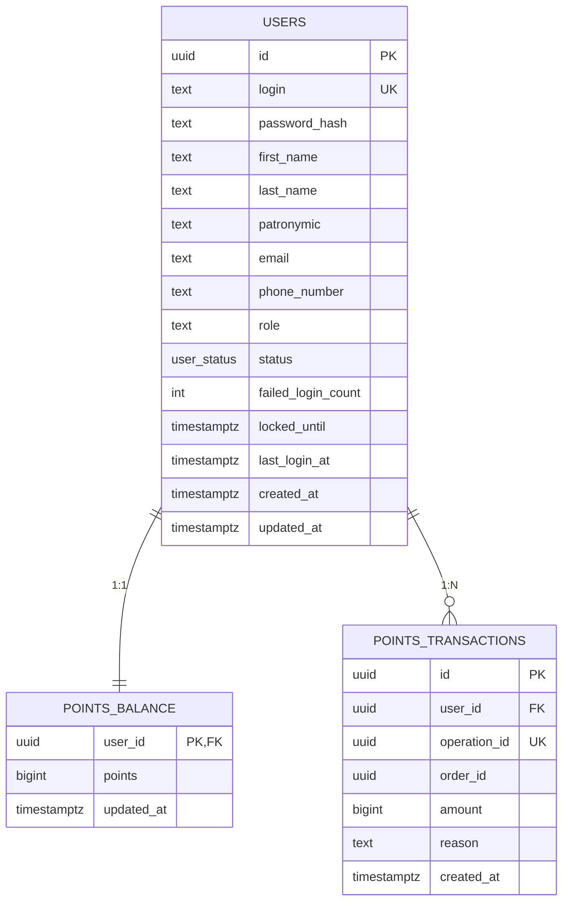

##### 17.1.2 `users`

| Поле | Тип | Ограничения | Описание |
|---|---|---|---|
| `id` | `UUID` | `PK`, default `gen_random_uuid()` | Идентификатор пользователя |
| `login` | `TEXT` | `NOT NULL`, `UNIQUE (lower(login))` | Логин; уникальность регистронезависимо |
| `password_hash` | `TEXT` | `NOT NULL` | bcrypt cost=12; plaintext не хранится |
| `first_name` | `TEXT` | `NOT NULL`, `CHECK length BETWEEN 1 AND 100` | Имя |
| `last_name` | `TEXT` | `NOT NULL`, `CHECK length BETWEEN 1 AND 100` | Фамилия |
| `patronymic` | `TEXT` | `NULL` допустим, `CHECK length BETWEEN 1 AND 100` | Отчество; может отсутствовать (иностранные сотрудники) |
| `email` | `TEXT` | `NULL` допустим, `CHECK email ~* '^[^@]+@[^@]+\\.[^@]+$'` | На будущее — для уведомлений |
| `phone_number` | `TEXT` | `NULL` допустим, `CHECK phone_number ~ '^\+?[1-9][0-9]{6,14}$'` | E.164-формат (`+7XXXXXXXXXX`) |
| `role` | `TEXT` | `NOT NULL`, default `'user'`, `CHECK role IN ('user','admin')` | Роль пользователя (см. §17.1.5) |
| `status` | `user_status` (enum) | `NOT NULL`, default `'active'` | См. ниже **Значения `status`** |
| `failed_login_count` | `INT` | `NOT NULL`, default `0`, `CHECK >= 0` | Счётчик неудачных подряд попыток входа; сбрасывается при успешном входе |
| `locked_until` | `TIMESTAMPTZ` | `NULL` допустим | До какого момента вход запрещён (rate-limit на 5 минут после 5 неудачных попыток) |
| `last_login_at` | `TIMESTAMPTZ` | `NULL` допустим | Последний успешный вход |
| `created_at` | `TIMESTAMPTZ` | `NOT NULL`, default `NOW()` | Дата регистрации |
| `updated_at` | `TIMESTAMPTZ` | `NOT NULL`, default `NOW()` | Поддерживается триггером |

**Значения `status` (enum `user_status`):**

- `active` — обычное рабочее состояние; пользователь может входить и пользоваться системой.
- `blocked` — учётка заблокирована администратором (`Admin.BlockUser`). Login возвращает `PERMISSION_DENIED`; восстановление — только через `Admin.ChangeStatus(active)`. Используется при увольнении сотрудника или нарушениях.

Замечание про `locked_until`: это **временное rate-limit-блокирование** на 5 минут после 5 неудачных подряд попыток входа (FR-AUTH §6). Сам `status` при этом остаётся `active` — это разные механизмы:
- `status='blocked'` — постоянная блокировка от админа.
- `locked_until > NOW()` — короткая авто-блокировка от подбора пароля.

`user_status` оставлен enum (не отдельная таблица), потому что значений ровно два, и они жёстко зашиты в бизнес-логику. Новые статусы не предполагаются — в отличие от `role`, где появление новых ролей вероятно (см. §17.1.5).

##### 17.1.3 `points_balance`

| Поле | Тип | Ограничения | Описание |
|---|---|---|---|
| `user_id` | `UUID` | `PK`, `FK → users(id) ON DELETE RESTRICT` | 1:1 к пользователю |
| `points` | `BIGINT` | `NOT NULL`, default `0`, `CHECK >= 0` | Текущий баланс баллов |
| `updated_at` | `TIMESTAMPTZ` | `NOT NULL`, default `NOW()` | Время последнего изменения |

##### 17.1.4 `points_transactions`

| Поле | Тип | Ограничения | Описание |
|---|---|---|---|
| `id` | `UUID` | `PK`, default `gen_random_uuid()` | Идентификатор транзакции |
| `user_id` | `UUID` | `NOT NULL`, `FK → users(id) ON DELETE RESTRICT` | Чьи баллы |
| `operation_id` | `UUID` | `NOT NULL`, `UNIQUE` | **Ключ идемпотентности** для AddPoints / GrantPoints / DeductPoints; см. §17.7 |
| `order_id` | `UUID` | `NULL` допустим | Логическая ссылка на заказ (без FK — другой сервис). Заполнен для списаний и возвратов по заказу, NULL для прочих начислений |
| `amount` | `BIGINT` | `NOT NULL`, `CHECK amount <> 0` | Дельта баллов; отрицательная для списаний, положительная для начислений и возвратов |
| `reason` | `TEXT` | `NOT NULL`, `CHECK length BETWEEN 1 AND 500` | Человекочитаемая причина (бизнес-требование для аудита и для отображения в истории операций) |
| `created_at` | `TIMESTAMPTZ` | `NOT NULL`, default `NOW()` | Когда зафиксирована |

##### 17.1.5 Роль (`users.role`)

Роль хранится прямо в колонке `users.role` как строковый код, без отдельной таблицы-справочника. В MVP допустимы ровно два значения, что фиксируется ограничением `CHECK (role IN ('user','admin'))`; при регистрации роль выставляется в `user` (default). Для добавления новой роли в будущем (например, `super_admin`, `auditor`, `viewer`) достаточно расширить `CHECK`-ограничение миграцией — отдельная таблица не нужна, пока с ролью не связаны дополнительные атрибуты.

| Код | Назначение |
|---|---|
| `user` | Сотрудник: каталог, своя корзина, свои заказы, свой баланс. Выставляется автоматически при регистрации. |
| `admin` | Администратор: всё, что может сотрудник, плюс управление каталогом, остатками, начисление баллов, управление пользователями и заказами. |

**Проверка роли:** интерсептор `pkg/auth.AdminOnly` сравнивает JWT-claim `role` со строковым кодом. Сервис User кладёт в JWT `role: users.role` при логине; остальные сервисы доверяют этому значению.

---

#### 17.2 Product Service DB

В этом сервисе появились две новые справочные таблицы (`categories`, `sizes`) и связь M:N (`product_sizes`) — устраняем нарушения 1NF, бывшие в `products.category TEXT` и `products.sizes TEXT[]`.

##### 17.2.1 ER-диаграмма

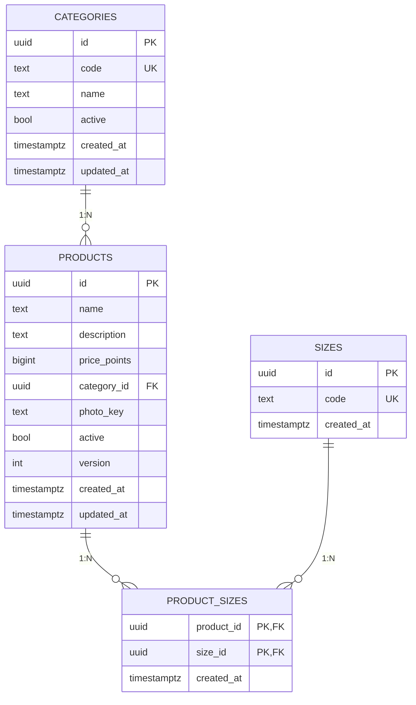

##### 17.2.2 `categories`

| Поле | Тип | Ограничения | Описание |
|---|---|---|---|
| `id` | `UUID` | `PK`, default `gen_random_uuid()` | Идентификатор категории |
| `code` | `TEXT` | `NOT NULL`, `UNIQUE`, `CHECK ~ '^[a-z0-9_-]{1,50}$'` | Slug: `tshirts`, `mugs`, `hoodies` |
| `name` | `TEXT` | `NOT NULL`, `CHECK length BETWEEN 1 AND 100` | Отображаемое название |
| `active` | `BOOLEAN` | `NOT NULL`, default `TRUE` | Деактивированные категории скрыты в каталоге |
| `created_at` | `TIMESTAMPTZ` | `NOT NULL`, default `NOW()` | |
| `updated_at` | `TIMESTAMPTZ` | `NOT NULL`, default `NOW()` | |

##### 17.2.3 `sizes` (мастер-справочник)

| Поле | Тип | Ограничения | Описание |
|---|---|---|---|
| `id` | `UUID` | `PK` | Идентификатор размера |
| `code` | `TEXT` | `NOT NULL`, `UNIQUE`, `CHECK ~ '^[A-Z0-9]{1,10}$'` | `XS`, `S`, `M`, `L`, `XL`, `XXL`, `ONESIZE` |
| `created_at` | `TIMESTAMPTZ` | `NOT NULL`, default `NOW()` | |

##### 17.2.4 `products`

| Поле | Тип | Ограничения | Описание |
|---|---|---|---|
| `id` | `UUID` | `PK` | Идентификатор товара |
| `name` | `TEXT` | `NOT NULL`, `CHECK length BETWEEN 1 AND 200` | Название |
| `description` | `TEXT` | `CHECK length <= 2000` | Описание |
| `price_points` | `BIGINT` | `NOT NULL`, `CHECK > 0` | Цена в баллах |
| `category_id` | `UUID` | `NOT NULL`, `FK → categories(id) ON DELETE RESTRICT` | Категория |
| `photo_key` | `TEXT` | `NULL` до загрузки фото; затем `NOT NULL` (валидация на уровне приложения) | Ключ объекта в MinIO |
| `active` | `BOOLEAN` | `NOT NULL`, default `TRUE` | Мягкая деактивация |
| `version` | `INT` | `NOT NULL`, default `1` | Оптимистическая блокировка |
| `created_at` | `TIMESTAMPTZ` | `NOT NULL`, default `NOW()` | |
| `updated_at` | `TIMESTAMPTZ` | `NOT NULL`, default `NOW()` | |

##### 17.2.5 `product_sizes` (M:N)

| Поле | Тип | Ограничения | Описание |
|---|---|---|---|
| `product_id` | `UUID` | `PK` (составной), `FK → products(id) ON DELETE CASCADE` | Товар |
| `size_id` | `UUID` | `PK` (составной), `FK → sizes(id) ON DELETE RESTRICT` | Размер |
| `created_at` | `TIMESTAMPTZ` | `NOT NULL`, default `NOW()` | Когда размер привязан к товару |

---

#### 17.3 Cart Service DB

##### 17.3.1 ER-диаграмма

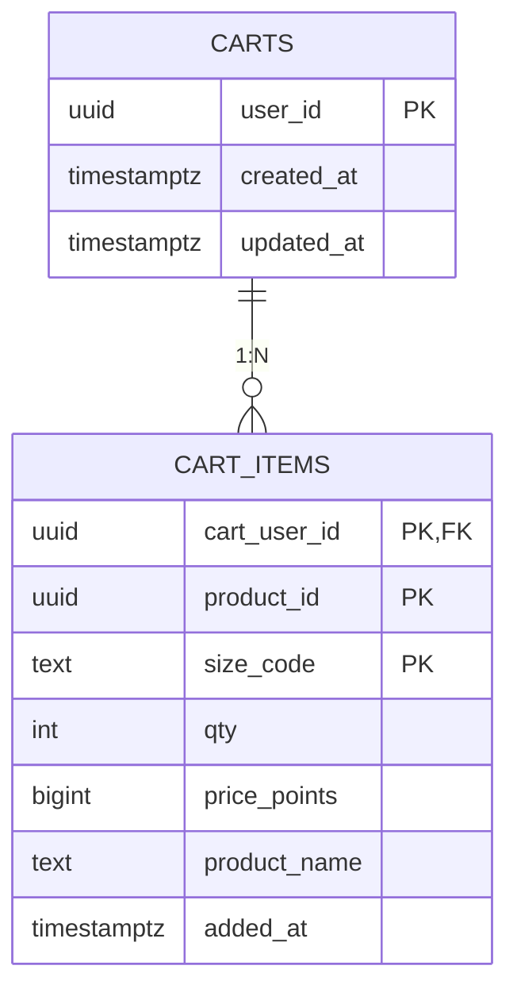

##### 17.3.2 `carts`

| Поле | Тип | Ограничения | Описание |
|---|---|---|---|
| `user_id` | `UUID` | `PK` | Владелец корзины (логическая ссылка на User Service) |
| `created_at` | `TIMESTAMPTZ` | `NOT NULL`, default `NOW()` | Когда создана |
| `updated_at` | `TIMESTAMPTZ` | `NOT NULL`, default `NOW()` | Последняя активность; **не TTL** — корзина не очищается автоматически |

##### 17.3.3 `cart_items`

| Поле | Тип | Ограничения | Описание |
|---|---|---|---|
| `cart_user_id` | `UUID` | `PK` (составной), `FK → carts(user_id) ON DELETE CASCADE` | К какой корзине |
| `product_id` | `UUID` | `PK` (составной) | Товар (без FK — другой сервис) |
| `size_code` | `TEXT` | `PK` (составной), `CHECK ~ '^[A-Z0-9]{1,10}$'` | Размер (валидация в Product Service при AddItem) |
| `qty` | `INT` | `NOT NULL`, `CHECK BETWEEN 1 AND 100` | Количество (лимит из NFR) |
| `price_points` | `BIGINT` | `NOT NULL`, `CHECK > 0` | **Снапшот** цены на момент добавления (см. §17.8) |
| `product_name` | `TEXT` | `NOT NULL`, `CHECK length BETWEEN 1 AND 200` | **Снапшот** названия на момент добавления |
| `added_at` | `TIMESTAMPTZ` | `NOT NULL`, default `NOW()` | Момент добавления (для UX «недавно добавлено» и аналитики) |

Параллельно Redis-кеш по ключу `cart:{user_id}` хранит JSON-снапшот всей корзины с TTL 1800 сек. Postgres — источник истины; кеш переcобирается при истечении TTL.

---

#### 17.4 Order Service DB

##### 17.4.1 ER-диаграмма

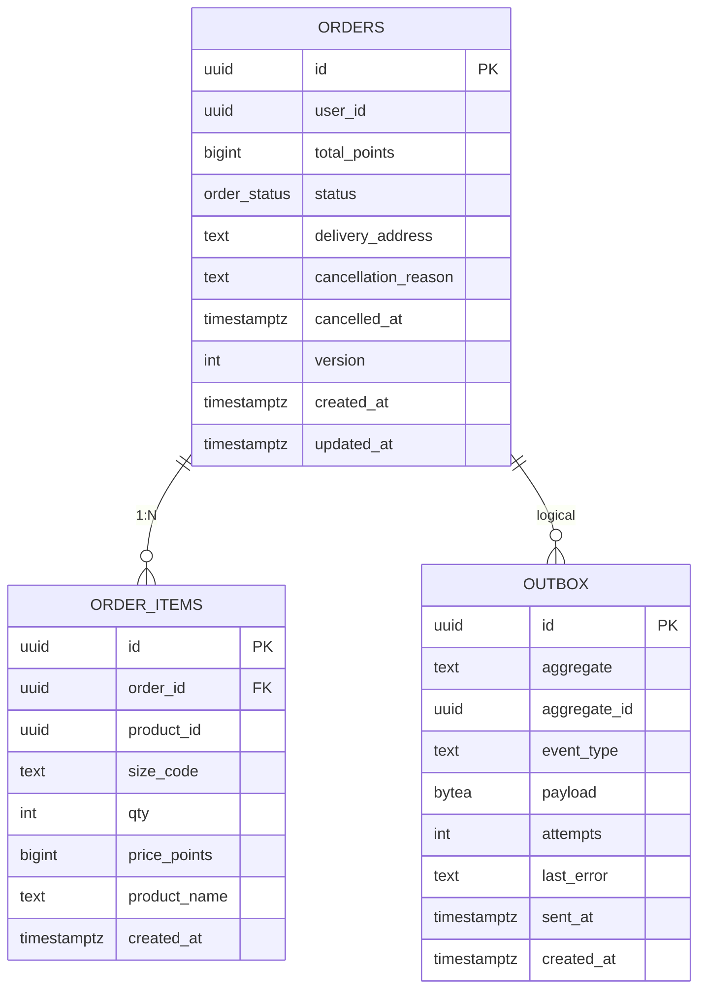

##### 17.4.2 `orders`

| Поле | Тип | Ограничения | Описание |
|---|---|---|---|
| `id` | `UUID` | `PK` | Идентификатор заказа |
| `user_id` | `UUID` | `NOT NULL` | Владелец (логическая ссылка) |
| `total_points` | `BIGINT` | `NOT NULL`, `CHECK > 0` | Итоговая сумма в баллах |
| `status` | `order_status` (enum) | `NOT NULL`, default `'pending'` | Статус заказа |
| `delivery_address` | `TEXT` | `NOT NULL`, `CHECK length BETWEEN 1 AND 500` | Куда выдать |
| `cancellation_reason` | `TEXT` | `NULL` допустим, `CHECK length <= 500` | Заполняется при отмене |
| `cancelled_at` | `TIMESTAMPTZ` | `NULL` допустим | Заполняется при отмене |
| `version` | `INT` | `NOT NULL`, default `1` | Оптимистическая блокировка для смены статуса |
| `created_at` | `TIMESTAMPTZ` | `NOT NULL`, default `NOW()` | |
| `updated_at` | `TIMESTAMPTZ` | `NOT NULL`, default `NOW()` | |

##### 17.4.3 `order_items`

| Поле | Тип | Ограничения | Описание |
|---|---|---|---|
| `id` | `UUID` | `PK` | Идентификатор позиции |
| `order_id` | `UUID` | `NOT NULL`, `FK → orders(id) ON DELETE RESTRICT` | Родительский заказ |
| `product_id` | `UUID` | `NOT NULL` | Товар (логическая ссылка) |
| `size_code` | `TEXT` | `NOT NULL`, `CHECK ~ '^[A-Z0-9]{1,10}$'` | Размер |
| `qty` | `INT` | `NOT NULL`, `CHECK BETWEEN 1 AND 100` | Количество |
| `price_points` | `BIGINT` | `NOT NULL`, `CHECK > 0` | **Снапшот** цены на момент оформления (см. §17.8) |
| `product_name` | `TEXT` | `NOT NULL`, `CHECK length BETWEEN 1 AND 200` | **Снапшот** названия на момент оформления |
| `created_at` | `TIMESTAMPTZ` | `NOT NULL`, default `NOW()` | |

##### 17.4.4 `outbox`

| Поле | Тип | Ограничения | Описание |
|---|---|---|---|
| `id` | `UUID` | `PK` | Идентификатор события |
| `aggregate` | `TEXT` | `NOT NULL`, `CHECK length BETWEEN 1 AND 50` | Тип агрегата (`order`) |
| `aggregate_id` | `UUID` | `NOT NULL` | Идентификатор агрегата (например, `order_id`) — для трассировки |
| `event_type` | `TEXT` | `NOT NULL`, `CHECK length BETWEEN 1 AND 100` | `order.created` |
| `payload` | `BYTEA` | `NOT NULL` | Protobuf-сериализованное событие |
| `attempts` | `INT` | `NOT NULL`, default `0`, `CHECK >= 0` | Сколько раз пытались опубликовать |
| `last_error` | `TEXT` | `NULL` допустим | Последняя ошибка (для диагностики) |
| `sent_at` | `TIMESTAMPTZ` | `NULL` до публикации | Время успешной отправки в Kafka |
| `created_at` | `TIMESTAMPTZ` | `NOT NULL`, default `NOW()` | Когда событие добавлено в outbox |

---

#### 17.5 Inventory Service DB

##### 17.5.1 ER-диаграмма

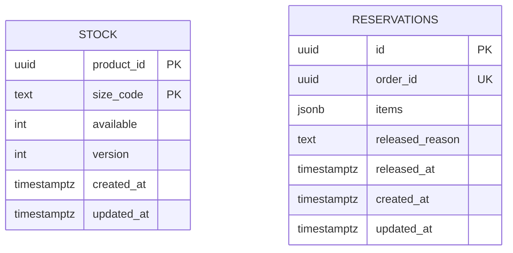

##### 17.5.2 `stock`

| Поле | Тип | Ограничения | Описание |
|---|---|---|---|
| `product_id` | `UUID` | `PK` (составной) | Товар (логическая ссылка) |
| `size_code` | `TEXT` | `PK` (составной), `CHECK ~ '^[A-Z0-9]{1,10}$'` | Размер |
| `available` | `INT` | `NOT NULL`, default `0`, `CHECK >= 0` | Доступное количество (за вычетом резервов) |
| `version` | `INT` | `NOT NULL`, default `1` | Оптимистическая блокировка при конкурентных AdjustStock/ReserveStock |
| `created_at` | `TIMESTAMPTZ` | `NOT NULL`, default `NOW()` | |
| `updated_at` | `TIMESTAMPTZ` | `NOT NULL`, default `NOW()` | |

##### 17.5.3 `reservations`

| Поле | Тип | Ограничения | Описание |
|---|---|---|---|
| `id` | `UUID` | `PK` | Идентификатор резерва |
| `order_id` | `UUID` | `NOT NULL`, `UNIQUE` | Ключ идемпотентности (см. §17.7) |
| `items` | `JSONB` | `NOT NULL`, `CHECK jsonb_array_length(items) >= 1` | Массив `{product_id, size_code, qty}` — см. JSON-схему ниже |
| `released_reason` | `TEXT` | `NULL` допустим | Заполняется при ReleaseReserve |
| `released_at` | `TIMESTAMPTZ` | `NULL` до снятия | Когда резерв снят |
| `created_at` | `TIMESTAMPTZ` | `NOT NULL`, default `NOW()` | |
| `updated_at` | `TIMESTAMPTZ` | `NOT NULL`, default `NOW()` | |

**Структура `items` (JSONB):**

```json
[
  { "product_id": "550e8400-e29b-41d4-a716-446655440000",
    "size_code":  "M",
    "qty":        2 },
  { "product_id": "660e8400-e29b-41d4-a716-446655440111",
    "size_code":  "L",
    "qty":        1 }
]
```

Валидация структуры — на стороне Inventory Service до INSERT (через protobuf-схему события `order.created`). Обоснование сохранения JSONB — в §17.8.

---

#### 17.6 Сводная таблица индексов

| Сервис | Таблица | Индекс | Тип | Зачем |
|---|---|---|---|---|
| User | `users` | `users_login_lower_uk` | UNIQUE B-tree на `lower(login)` | Регистронезависимая уникальность логина и быстрый поиск при логине |
| User | `users` | `users_status_idx` | Частичный B-tree (`WHERE status='blocked'`) | Быстрый отчёт по заблокированным; основной список — короткий |
| User | `points_transactions` | `points_tx_operation_id_uk` | UNIQUE (`operation_id`) | Единый ключ идемпотентности для всех методов изменения баланса (см. §17.7) |
| User | `points_transactions` | `points_tx_user_created_idx` | B-tree `(user_id, created_at DESC)` | История операций пользователя |
| Product | `categories` | `categories_active_name_idx` | Частичный B-tree `(name) WHERE active` | Список активных категорий, отсортированный по названию |
| Product | `products` | `products_category_active_idx` | Частичный B-tree `(category_id) WHERE active` | Фильтр каталога по категории |
| Product | `products` | `products_active_created_idx` | Частичный B-tree `(created_at DESC) WHERE active` | Сортировка «новые сверху» |
| Product | `products` | `products_name_fts_idx` | GIN `to_tsvector('simple', name)` | Полнотекстовый поиск по названию |
| Product | `product_sizes` | `product_sizes_size_idx` | B-tree `(size_id)` | Запросы «в каких товарах есть размер X» |
| Order | `orders` | `orders_status_idx` | B-tree `(status)` | Фильтр в админских списках |
| Order | `orders` | `orders_user_created_idx` | B-tree `(user_id, created_at DESC)` | История заказов пользователя |
| Order | `order_items` | `order_items_order_idx` | B-tree `(order_id)` | Подгрузка позиций заказа |
| Order | `outbox` | `outbox_unsent_idx` | Частичный B-tree `(created_at) WHERE sent_at IS NULL` | Воркер-доставщик в Kafka |
| Order | `outbox` | `outbox_aggregate_idx` | B-tree `(aggregate, aggregate_id)` | Поиск событий по агрегату при инцидентах |
| Inventory | `stock` | `stock_product_idx` | B-tree `(product_id)` | Агрегация «есть ли товар в каком-то размере» |
| Inventory | `reservations` | `reservations_active_idx` | Частичный B-tree `(created_at) WHERE released_at IS NULL` | Активные резервы для отмены и дашбордов |

PK-индексы (`PRIMARY KEY`) и UNIQUE-индексы непосредственно на колонках в таблицу не включены — они создаются автоматически по соответствующим объявлениям.

---

#### 17.7 Ключи идемпотентности

Каждая «опасная» write-операция использует уникальный ключ, по которому повторный вызов с теми же параметрами не приводит к повторному эффекту. Ключи закреплены UNIQUE-индексами в БД, поэтому защищены даже при состояниях гонки.

| Метод | Ключ | Где хранится | UNIQUE-индекс | Поведение при повторе |
|---|---|---|---|---|
| `User.DeductPoints` (Order → User при CreateOrder) | `operation_id` = `order_id` | `points_transactions.operation_id` | `points_tx_operation_id_uk` | Возврат текущего баланса без изменения |
| `User.AddPoints` (Order → User при компенсации отмены) | `operation_id` = `order_id + '-refund'` | `points_transactions.operation_id` | `points_transactions_operation_id_key` (UNIQUE на колонке) | Возврат текущего баланса без изменения |
| `User.GrantPoints` (admin → User) | `operation_id` (UUID, генерируется клиентом или Gateway) | `points_transactions.operation_id` | Тот же UNIQUE | Возврат текущего баланса без изменения |
| `Inventory.AdjustStock` (admin) | `operation_id` (UUID) | На уровне приложения через таблицу `stock_operations` (вне MVP — в MVP проверка `operation_id` в кеше) или `version`-чек | `version` mismatch → 409 Conflict, ретрай безопасен | Возврат текущего `available` |
| `Inventory.ReserveStock` (Kafka consumer) | `order_id` | `reservations.order_id` | `reservations_order_id_key` (UNIQUE) | Возврат существующего резерва; Kafka-offset коммитится |
| `Inventory.ReleaseReserve` (Order → Inventory при отмене) | `order_id` | `reservations.order_id` (тот же ряд) + проверка `released_at` | Не нужен дополнительный индекс | Если уже released — возврат успеха без изменения |
| `Order.CreateOrder` (user → Order) | `order_id` (UUID, генерируется клиентом или Gateway) | `orders.id` (PK) | PK | Возврат существующего заказа без повторного создания (`SELECT FOR UPDATE`) |
| `Order.UpdateStatus` (Inventory или admin) | Текущая `version` заказа | `orders.version` | Update по `(id, version)` | При version-mismatch — 409, клиент перечитывает заказ |

> Примечание про `Inventory.AdjustStock` в MVP: явная таблица `stock_operations` для аудита и идемпотентности — backlog. В MVP `version` + клиентский `operation_id` достаточно: повторный вызов с тем же `operation_id` и `version` фактически приведёт к no-op после первого успешного UPDATE.

---

#### 17.8 Соответствие нормальным формам и обоснованные отступления

**Краткие определения:**

- **1NF (первая нормальная форма):** каждый атрибут содержит атомарное значение (нет массивов, JSON-структур, повторяющихся групп).
- **2NF:** в 1NF, и каждый неключевой атрибут зависит от *всего* составного ключа, а не от его части.
- **3NF:** в 2NF, и нет транзитивных зависимостей `ключ → A → B` для неключевых `A, B`.

##### 17.8.1 Таблицы, соответствующие 3NF

`users`, `points_balance`, `points_transactions`, `categories`, `sizes`, `product_sizes`, `products`, `carts`, `orders`, `outbox`, `stock` — все атрибуты атомарны, каждый неключевой атрибут функционально зависит только от первичного ключа, транзитивных зависимостей нет.

##### 17.8.2 Обоснованные отступления

###### Отступление 1. `cart_items.product_name`, `cart_items.price_points` — нарушение 3NF (транзитивная зависимость)

**Что нарушается.** Эти атрибуты функционально зависят от `product_id` (через `products.name`, `products.price_points`), а не напрямую от первичного ключа `cart_items`. Это транзитивная зависимость, в строгой 3NF их быть не должно.

**Зачем оставлено.** Снапшот значений на момент добавления в корзину. Бизнес-требование (FINAL_SPEC §3.3): при изменении/деактивации товара уже добавленные в корзину позиции должны показывать историческую цену и название, не меняясь.

**Альтернатива и почему отвергнута.** Можно было ввести таблицу `product_versions(product_id, version, name, price_points, valid_from, valid_to)` и хранить в `cart_items` ссылку на конкретную версию. Это бы вернуло строгую 3NF. Отвергнуто:
- Каждый `AddItem` стал бы требовать вставки новой версии товара при любом изменении (доп. сложность в Product Service).
- `GetCart` потребовал бы JOIN с версионной таблицей — лишний кросс-сервисный вызов в Cart Service.
- Снапшоты — типовое промышленное решение для cart/order line items; читаются всеми SQL-разработчиками с первого взгляда.

###### Отступление 2. `order_items.product_name`, `order_items.price_points` — нарушение 3NF (то же, что и cart_items)

Обоснование идентично отступлению 1. Дополнительная причина: исторические заказы должны переживать удаление/деактивацию товаров и категорий неограниченно долго; даже если в будущем Product Service полностью удалит товар, в исторических заказах данные останутся читабельными.

###### Отступление 3. `reservations.items JSONB` — нарушение 1NF (не атомарный атрибут)

**Что нарушается.** Столбец `items` хранит JSON-массив объектов `{product_id, size_code, qty}` — это не атомарное значение.

**Зачем оставлено.** Атомарная единица резервирования — *весь* заказ целиком. Резервирование описывается одним соглашением: «по этому `order_id` в этих количествах товары забронированы». Idempotency-ключом является `order_id` (UNIQUE), частичное снятие резерва бизнес-логикой не предусмотрено.

**Дополнительные мотивы:**
- Payload события `order.created` в Kafka сериализуется в тот же формат — нет рассинхрона между событием и записью БД.
- Одна вставка `reservations` + N `UPDATE stock` в одной транзакции; нормализованная `reservation_items` потребовала бы N+1 вставок.
- Чтение для дашборда «активные резервы» — простой `WHERE released_at IS NULL`; внутреннюю структуру читать не нужно.

**Альтернатива и почему отвергнута.** Таблица `reservation_items(reservation_id, product_id, size_code, qty)` — строго 1NF/3NF. Отвергнута:
- Усложняет идемпотентность ReserveStock (нужно убедиться, что весь набор позиций совпадает с уже существующим).
- Усложняет ReleaseReserve, поскольку придётся дополнительно блокировать FK-связь.
- Не даёт выигрыша на ожидаемом потоке (< 0.1 RPS на топик `order.created`).

### 18. Зависимости сервисов

#### 18.1 Карта межсервисного взаимодействия (синхронные gRPC-вызовы)

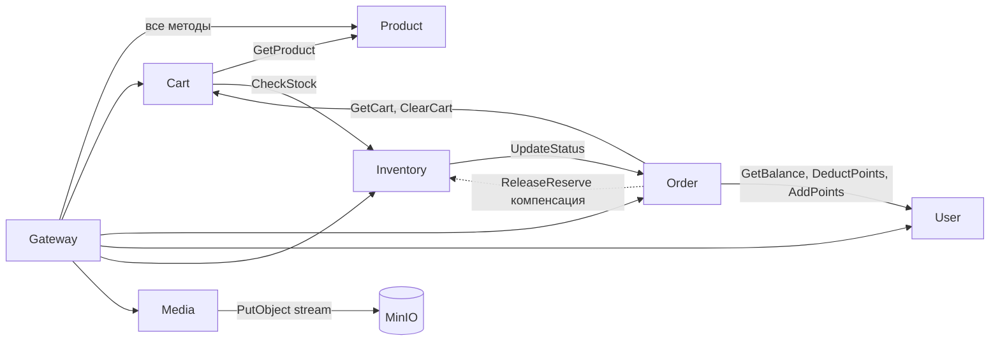

#### 18.2 Диаграмма событийных взаимодействий (асинхронные события в Kafka)

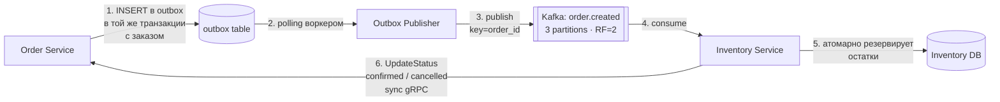

**Новые события:** `order.created` — единственное событие в MVP. **Существующих внешних событий нет** (внешних подписчиков/издателей за пределами Merch Store не предусмотрено).

### 19. Очереди

- **Топик:** `order.created`.
- **Партиций:** 3.
- **Replication factor:** 2.
- **Retention:** 7 дней.
- **Ключ партиционирования:** `order_id` — гарантирует упорядоченность событий по конкретному заказу.
- **Упорядоченность:** требуется только в рамках одного `order_id` (партиции).
- **Ожидаемый поток:** реалистично < 0.1 RPS, пиково ~1 RPS (десятки заказов в день, нерегулярно).
- **Тип события:** `order.created` с payload `{ order_id, user_id, items[], total_points, delivery_address, created_at }`.
- **Параллельная обработка:** не требуется — поток крайне низкий; consumer работает в один поток на партицию.
- **Метрики обработки:** `kafka_consumer_lag`, `events_processed_total`, `events_failed_total`, `reservation_duration_ms`.

### 20. Уведомления

В MVP не предусмотрены.

| Канал | Состояние в MVP |
|---|---|
| Realtime (WS / SSE) | Не используется. |
| Push | Не используется. |
| Email | Не используется. |
| Notification Center | Не используется. |

**Источник истины** для пользователя — личный кабинет (вкладка «Мои заказы»). Для администратора — раздел «Все заказы».

---

## ЧАСТЬ 4 — САМОПРОВЕРКА

### 21. Свойства системы

**Настройки аккаунта**
- Доступность фичи через CRM: не применимо — внутренний продукт без CRM-настроек.
- Дефолтные настройки: не требуются.
- Подписки: не применимо.
- Standalone: продукт изначально standalone (один тенант — компания).

**Клиенты**
- Frontend (AP/UP): да, единственный клиент — веб-фронтенд через API Gateway.
- Mobile: не планируется в MVP.
- REST/SOAP: REST через Gateway (фасад). Внутри — gRPC.
- Desktop: не применимо.
- Межсервисные (internal): gRPC между Gateway и доменными сервисами и между Cart↔Product/Inventory, Order↔Cart/User/Inventory.

**Особенности аккаунтов**
- Space/Page/Port, Business/Enterprise: не применимо.
- Standalone: один тип аккаунта (один тенант).

**Особенности окружений**
- Local: docker-compose со всеми зависимостями (Postgres, Redis, Kafka, MinIO).
- Test/Stage: Kubernetes-кластер, namespace `merch-stage`.
- Prod: Kubernetes-кластер, namespace `merch-prod`.
- Standalone: совпадает с prod.

**Последовательность релизов**
- Порядок миграций: только клиентские (через `migrate` в init-контейнерах подов).
- Доступность для клиентов / feature toggles: для MVP не требуются — один монолитный релиз.

**Ограничения**
- Размер фото: ≤ 5 МБ; форматы JPG/PNG/WEBP.
- Размер страницы каталога: 24 элемента.
- Максимум позиций в корзине: 100 (защита от злоупотреблений).
- Длина текстовых полей: name ≤ 200, description ≤ 2000, reason ≤ 500.
- Цикломатическая сложность: целевая ≤ 10 на функцию.
- Frontend объём данных: пагинация на всех листингах.
- Зависимость SQL-запросов: на одно действие пользователя — не более 5 SQL-запросов в gRPC-сервисе.

**Взаимодействие с внешними сервисами**
- CRM: не используется.
- Внешние API: отсутствуют в MVP.

**Масштабирование**

| Deployment | Назначение | Min replicas | Max (HPA) |
|---|---|---|---|
| api-gateway | Входная точка, JWT, маршрутизация | 2 | 8 |
| product-service | Каталог | 2 | 6 |
| cart-service | Корзина | 2 | 6 |
| order-service | Оформление, оркестрация | 2 | 8 |
| user-service | Auth, баланс | 2 | 4 |
| inventory-service | Остатки, резервы | 2 | 6 |
| media-service | Приём загружаемых фото и запись в MinIO (multipart/streaming) | 2 | 4 |

Шардирование БД не требуется в MVP (малый объём данных). HPA по CPU 70 % / memory 80 %.

**Отказоустойчивость**
- Все сервисы — stateless, поддерживают N>1 реплик; rolling update без downtime.
- Одновременная работа разных версий: контракты gRPC backward-compatible (только аддитивные изменения proto).
- Сбой одного сервиса: остальная система продолжает работать в границах своих зон ответственности (например, упал Cart → нельзя оформить заказ, но каталог и баланс доступны).

**Конфигурирование**
- Соответствие [12factor](https://12factor.net/ru/config): все секреты и параметры — через ENV; Kubernetes ConfigMaps + Secrets.

**Формат логов**
- Структурированные JSON-логи (zap).
- Обязательные поля: `service`, `level`, `ts`, `trace_id`, `user_id` (если есть), `method`.
- Уровни: ERROR при возврате 5xx/Internal; WARN при graceful fallback; INFO для бизнес-событий (заказ создан, статус сменён).
- Агрегация: Loki.

**Метрики Prometheus**
- gRPC RED: `requests_total{service,method,code}`, `request_duration_seconds_bucket`, `errors_total`.
- Kafka: `kafka_consumer_lag`, `events_processed_total`, `events_failed_total`.
- Outbox: `outbox_unsent_count`, `outbox_publish_duration_seconds`.
- Redis: `redis_cache_hit_ratio`, `redis_unavailable_total`.
- Бизнес: `orders_created_total{status}`, `points_granted_total`, `products_created_total`.

**Алерты и уведомления (для дежурных)**
- gRPC error rate по сервису > 1 % за 5 мин.
- Kafka consumer lag по `order.created` > 100 событий или > 1 мин.
- `outbox_unsent_count > 0` дольше 10 мин.
- Pod CrashLoopBackOff на любом сервисе.
- Заказы в статусе `pending` старше 5 мин.
- Доля 5xx от Gateway > 0.5 % за 5 мин.

**Инфраструктура**
- ServiceMesh (Linkerd) — **не подключён** в MVP. Рассмотреть в будущем для mTLS между сервисами и встроенной observability.
- Трассировка: OpenTelemetry + Jaeger (опционально, рекомендуется).

---

*Конец документа. TDR подлежит асинхронному ревью; для аппрува требуется ≥ 3 `CR: OK` (см. [`Flow.md`](./Flow.md)).*
