# Merch Store — Диаграммы

---

## 1. Архитектура сервисов

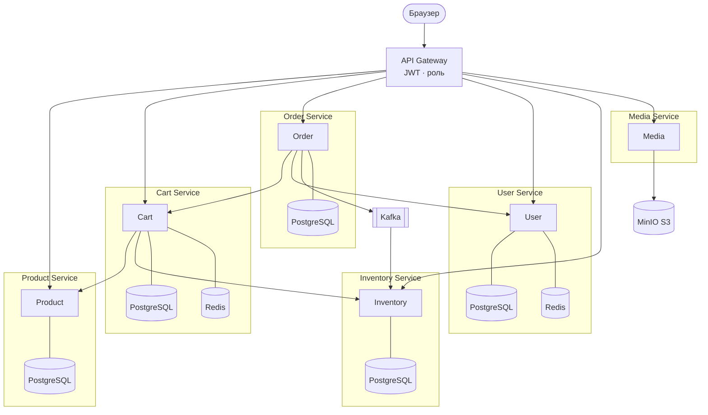

---

## 2. Sequence: Добавление товара в корзину

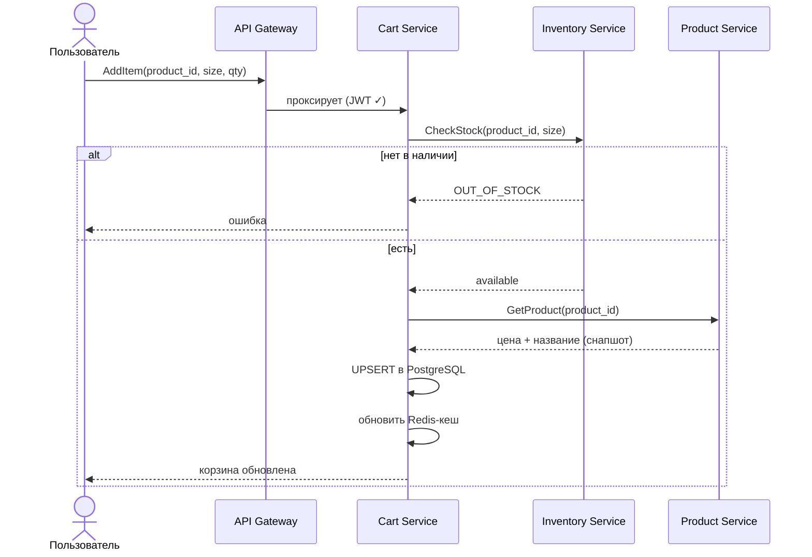

---

## 3. Sequence: Оформление заказа

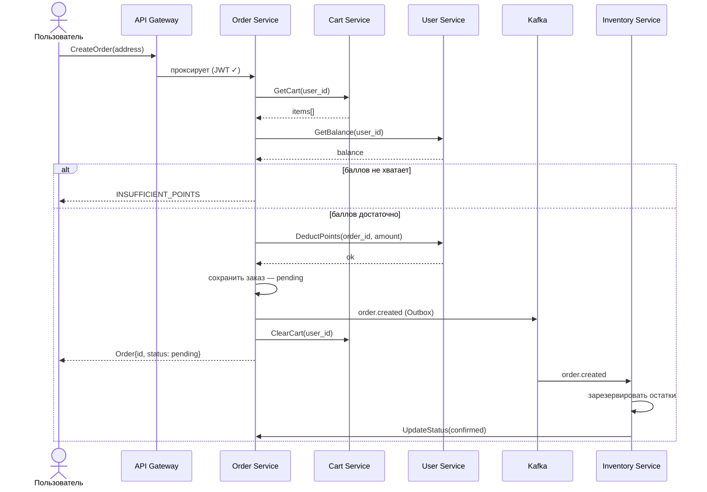

---

## 4. Sequence: Загрузка фото и создание товара (admin)

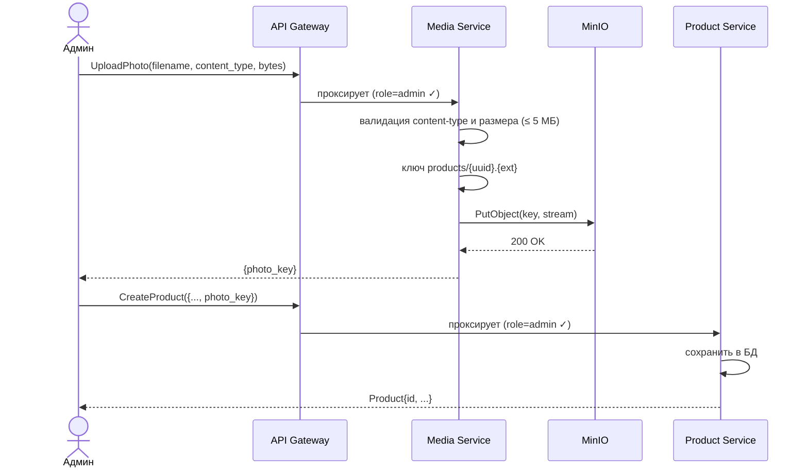

---

## 5. Sequence: Вход и выдача токенов

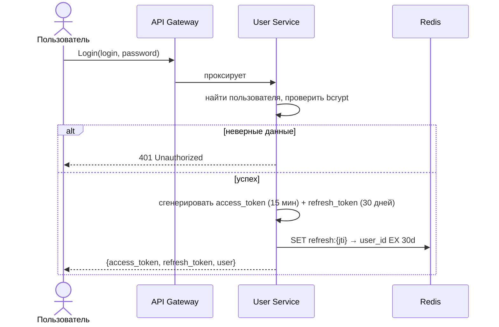

---

## 6. Sequence: Обновление access-токена

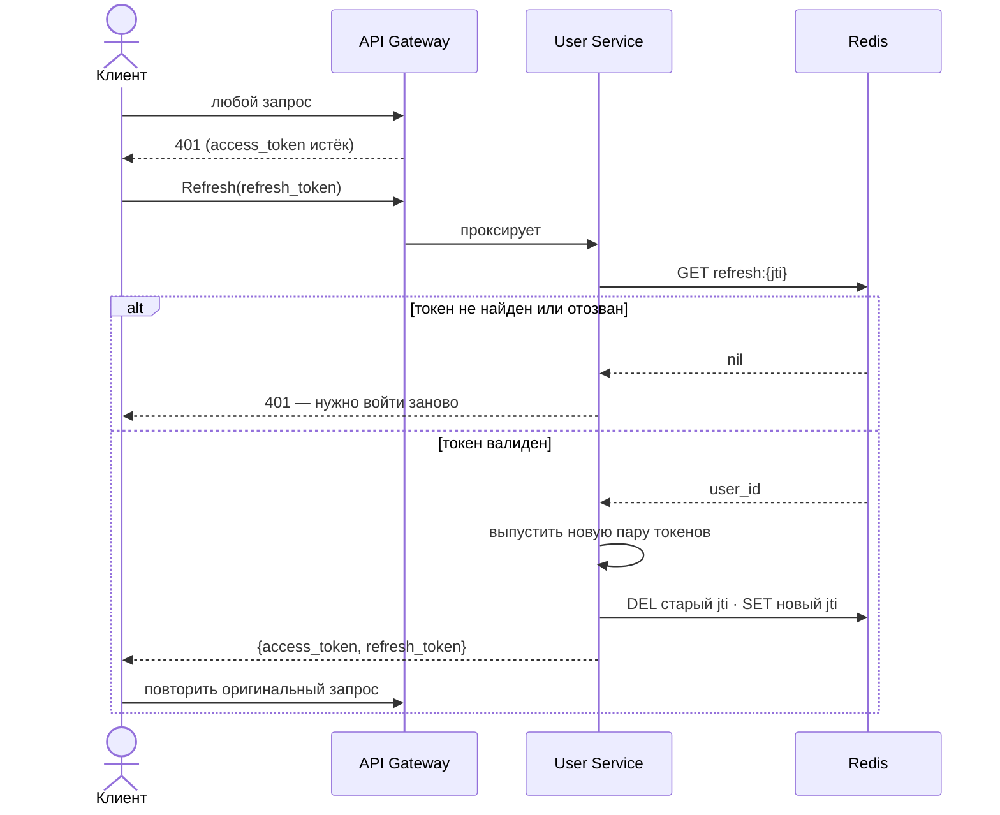

---

## 7. Sequence: Отмена заказа администратором (компенсация)

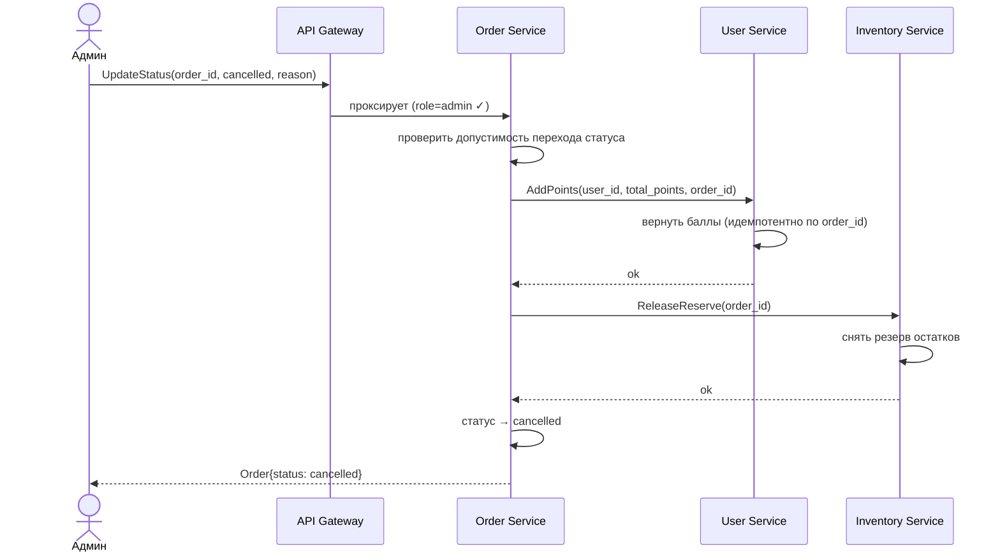

---

## 8. Sequence: Начисление баллов (admin)

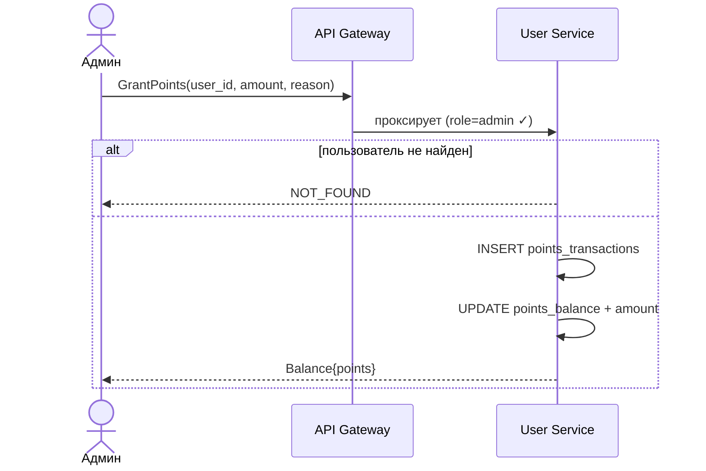

---

## 9. Состояния заказа

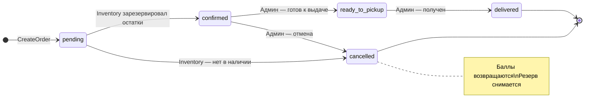

---

## 10. Схема сущностей по сервисам

Каждый сервис имеет собственную изолированную базу данных. Связи между сервисами — логические, на уровне приложения (по ID).

### User Service DB

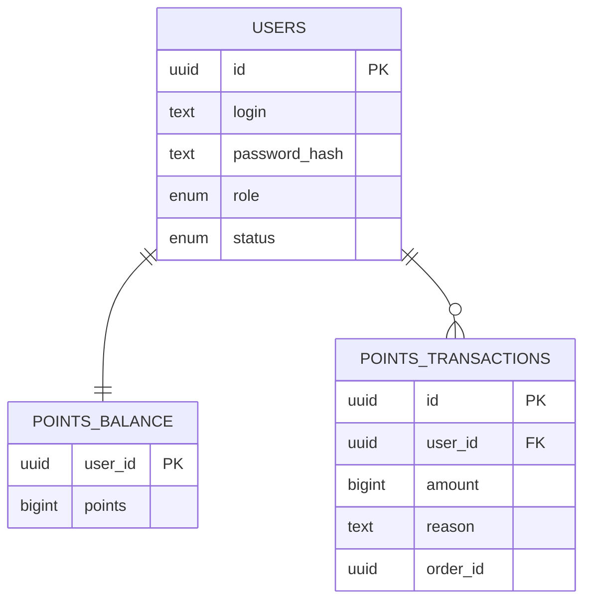

### Product Service DB

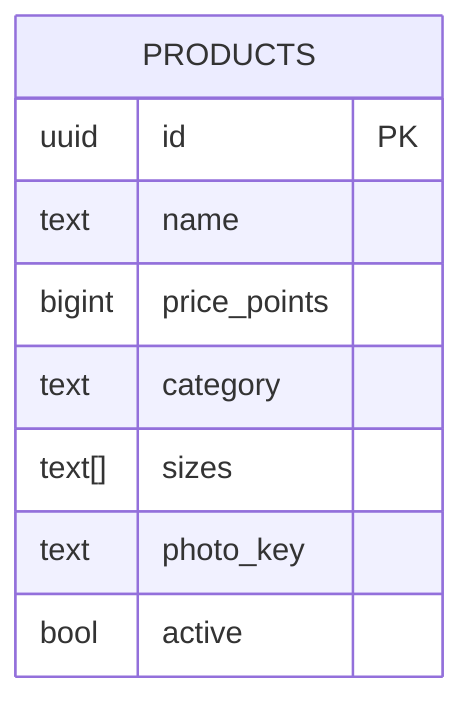

### Cart Service DB

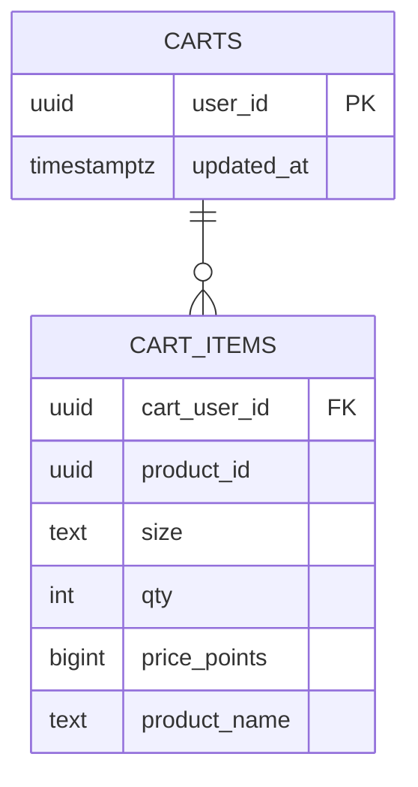

### Order Service DB

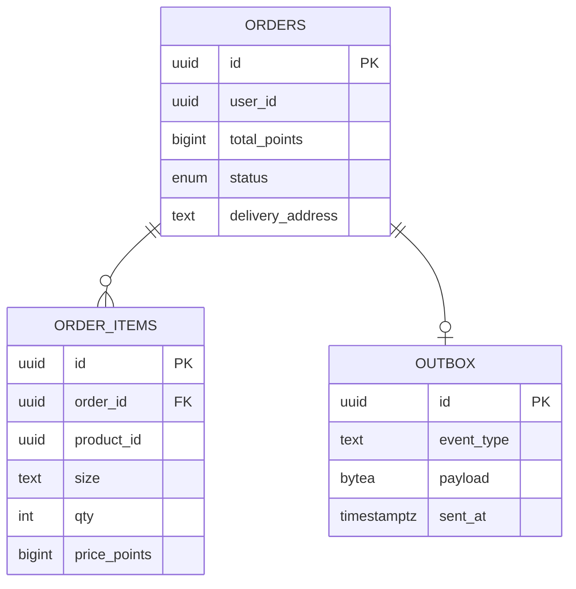

### Inventory Service DB

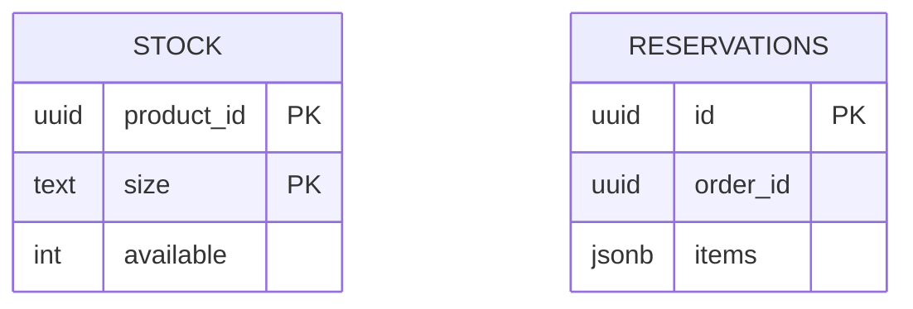
